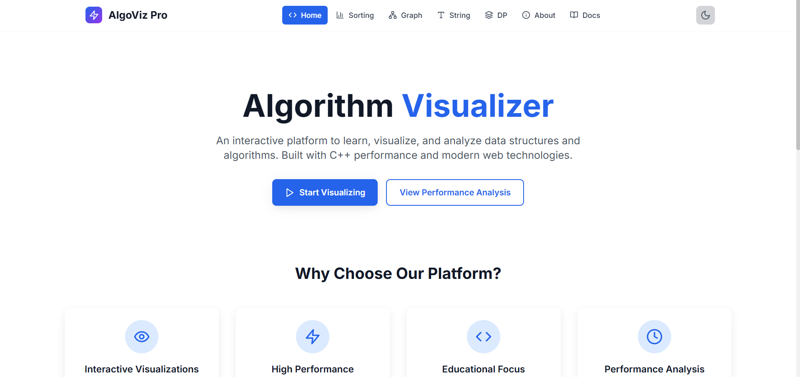
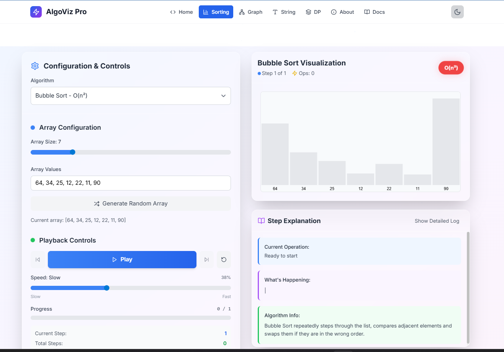
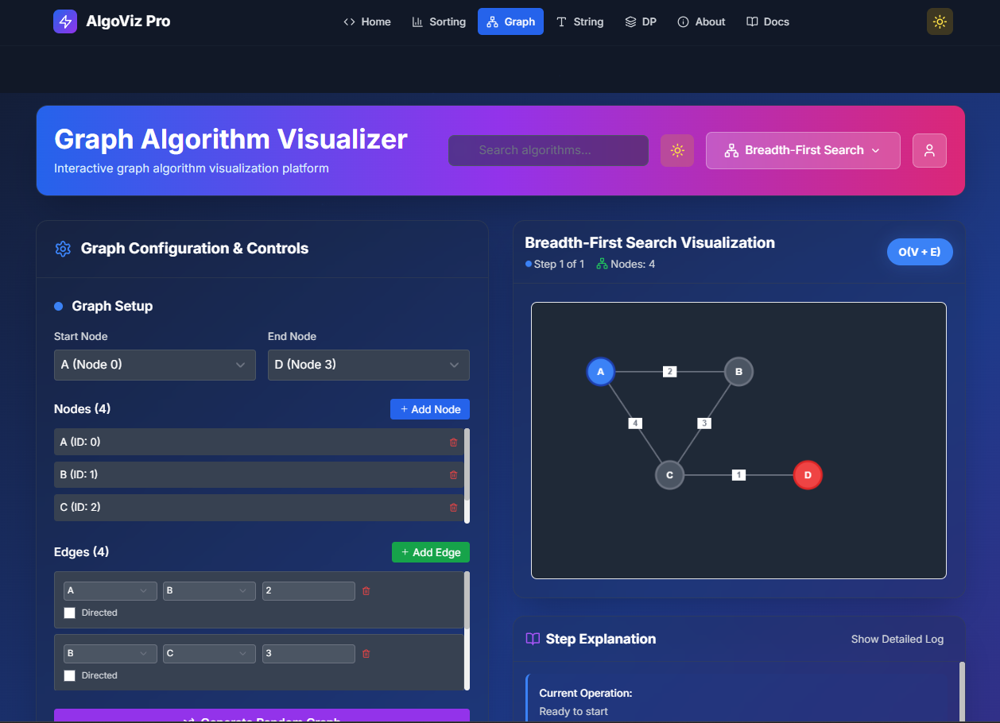

<div align="center">
  
  
  # 🎯 Algorithm Visualiser Pro
  
  **Transform Complex Algorithms into Interactive Visual Experiences**
  
  [](https://reactjs.org/)
  [](https://fastapi.tiangolo.com/)
  [](https://python.org/)
  [](LICENSE)
  [](https://github.com/CipherYuvraj/Algorithm-Visualiser-Platform)
  
  [🚀 Live Demo](https://algorithm-visualiser-yuvraj.onrender.com/) · [📖 Documentation](https://github.com/CipherYuvraj/Algorithm-Visualiser-Platform/) · [🐛 Report Bug](https://github.com/CipherYuvraj/Algorithm-Visualiser-Platform/issues) · [💡 Request Feature](https://github.com/CipherYuvraj/Algorithm-Visualiser-Platform/issues)
</div>

<p align="center">
  
</p>

---

## 📋 Table of Contents

- [🌟 Overview](#-overview)
- [✨ Key Features](#-key-features)
- [🛠️ Tech Stack](#️-tech-stack)
- [🎯 Why Choose Algorithm Visualiser Pro?](#-why-choose-algorithm-Visualiser-pro)
- [📸 Screenshots](#-screenshots)
- [🚀 Quick Start](#-quick-start)
- [⚙️ Installation](#️-installation)
- [🐳 Docker Setup](#-docker-setup)
- [☁️ Deployment](#️-deployment)
- [📚 Algorithm Categories](#-algorithm-categories)
- [🎨 UI/UX Features](#-uiux-features)
- [🔧 Configuration](#-configuration)
- [📊 Performance](#-performance)
- [🤝 Contributing](#-contributing)
- [📄 License](#-license)
- [👨‍💻 About the Developer](#-about-the-developer)

---

## 🌟 Overview

**Algorithm Visualiser Pro** is a cutting-edge educational platform that transforms abstract algorithmic concepts into engaging, interactive visual experiences. Built with modern web technologies, it serves as a comprehensive learning tool for students, educators, and algorithm enthusiasts worldwide.

### 🎯 Mission
To bridge the gap between theoretical computer science and practical understanding by providing intuitive, step-by-step algorithm visualizations that make complex concepts accessible to learners at all levels.

<p align="center">
  
</p>

---

## ✨ Key Features

<div align="center">
  <table>
    <tr>
      <td align="center" width="25%">
        
        <h4>Interactive Visualizations</h4>
        <p>Real-time step-by-step execution with customizable speed controls</p>
      </td>
      <td align="center" width="25%">
        
        <h4>Educational Focus</h4>
        <p>Comprehensive explanations with time/space complexity analysis</p>
      </td>
      <td align="center" width="25%">
        
        <h4>Responsive Design</h4>
        <p>Seamless experience across desktop, tablet, and mobile devices</p>
      </td>
      <td align="center" width="25%">
        
        <h4>Dark/Light Mode</h4>
        <p>Eye-friendly themes with smooth transitions and modern aesthetics</p>
      </td>
    </tr>
  </table>
</div>

### 🔥 Advanced Features

- **🎛️ Real-time Controls**: Play, pause, step-through, and speed adjustment
- **📊 Performance Metrics**: Live complexity analysis and execution statistics
- **🎨 Custom Themes**: Multiple color schemes and visual styles
- **💾 Save & Share**: Export visualizations and share with others
- **📝 Code Display**: Synchronized code highlighting during execution
- **🔊 Audio Feedback**: Optional sound effects for better engagement
- **📱 PWA Support**: Install as a desktop/mobile app
- **🌐 Multi-language**: Support for multiple programming languages

<p align="center">
  
</p>

---

## 🛠️ Tech Stack

<div align="center">
  
### Frontend Architecture
| Technology | Version | Purpose |
|------------|---------|---------|
| **React** | 18.2.0 | Core UI framework with hooks and context |
| **Create React App** | 5.0.1 | Build tool and development server |
| **TailwindCSS** | 3.3.0 | Utility-first styling framework |
| **Lucide React** | 0.294.0 | Beautiful icon library |
| **Framer Motion** | 10.16.0 | Smooth animations and transitions |

### Backend Architecture
| Technology | Version | Purpose |
|------------|---------|---------|
| **FastAPI** | 0.104.1 | High-performance async API framework |
| **Python** | 3.11+ | Core backend language |
| **Uvicorn** | 0.24.0 | ASGI server for production |
| **Pydantic** | 2.5.0 | Data validation and serialization |

### Development & Deployment
| Technology | Purpose |
|------------|---------|
| **Docker** | Containerization and consistent environments |
| **Docker Compose** | Multi-container orchestration |
| **Render** | Frontend deployment and CDN |
| **Render/Railway** | Backend API deployment |
| **GitHub Actions** | CI/CD pipeline automation |

</div>

<p align="center">
  
</p>

---

## 🎯 Why Choose Algorithm Visualiser Pro?

<div align="center">
  <table>
    <tr>
      <th>🆚 Feature</th>
      <th>✅ Algorithm Visualiser Pro</th>
      <th>❌ Traditional Learning</th>
    </tr>
    <tr>
      <td><strong>Learning Approach</strong></td>
      <td>Visual, Interactive, Step-by-step</td>
      <td>Text-based, Static examples</td>
    </tr>
    <tr>
      <td><strong>Engagement</strong></td>
      <td>High interactivity with real-time feedback</td>
      <td>Passive reading and memorization</td>
    </tr>
    <tr>
      <td><strong>Accessibility</strong></td>
      <td>Works on any device, responsive design</td>
      <td>Limited to textbooks or desktop software</td>
    </tr>
    <tr>
      <td><strong>Complexity Analysis</strong></td>
      <td>Real-time visualization of time/space complexity</td>
      <td>Abstract mathematical notation</td>
    </tr>
    <tr>
      <td><strong>Progress Tracking</strong></td>
      <td>Visual progress indicators and statistics</td>
      <td>Manual tracking required</td>
    </tr>
    <tr>
      <td><strong>Customization</strong></td>
      <td>Multiple themes, speeds, and input sizes</td>
      <td>Fixed presentation format</td>
    </tr>
  </table>
</div>

<p align="center">
  
</p>

---

## 📸 Screenshots

<div align="center">
  
### 🏠 Home Page


### 🎮 Algorithm Visualization


### 🌙 Dark Mode Experience


</div>

<p align="center">
  
</p>

---

## 🚀 Quick Start

Get up and running with these steps.

```bash
# 1. Fork and Clone the repository
git clone https://github.com/<your-username>/Algorithm-Visualiser-Platform.git
cd Algorithm-Visualiser-Platform

# 2. Install Frontend Dependencies
# (This command installs for the entire monorepo, including the frontend)
npm install

# 3. Setup and Install Backend Dependencies
# Create a virtual environment with Python 3.11
py -3.11 -m venv venv

# Activate the virtual environment
.\venv\Scripts\Activate.ps1
# On macOS/Linux, use: source venv/bin/activate

# Install Python packages
cd backend
pip install -r requirements.txt
cd ..

# 4. Run the Development Servers (in two separate terminals)

# In your FIRST terminal, run the backend:
# (Make sure your venv is active)
cd backend
uvicorn main:app --reload

# In your SECOND terminal, run the frontend:
cd frontend
npm start

# 🎉 Open your browser and start exploring!
```

<p align="center">
  
</p>

---

## ⚙️ Installation

### 📋 Prerequisites

- **Node.js** 18.0+ ([Download](https://nodejs.org/))
 - **Python** 3.11.x ([Download](https://www.python.org/downloads/release/python-3119/)) - *Note: Versions 3.12 and newer are not compatible with the project's dependencies.*
- **Git** ([Download](https://git-scm.com/))

### 🔧 Detailed Setup

<details>
<summary><strong>🖥️ Frontend Setup</strong></summary>

```bash
# Navigate to project root
cd Algorithm-Visualiser-Platform/frontend

# Install dependencies
npm install

# Available scripts
npm run dev          # Start development server
npm run build        # Build for production
npm run preview      # Preview production build
npm run lint         # Run ESLint
npm run lint:fix     # Fix ESLint issues
```

**Environment Variables** (`.env`):
```env
VITE_API_BASE_URL=http://localhost:8000
VITE_APP_TITLE="Algorithm Visualiser Pro"
VITE_ENABLE_ANALYTICS=false
```

</details>

<details>
<summary><strong>🔧 Backend Setup</strong></summary>

```bash
# Navigate to backend directory
cd Algorithm-Visualiser-Platform/backend

# Create virtual environment
python -m venv venv

# Activate virtual environment
# Windows:
venv\Scripts\activate
# macOS/Linux:
source venv/bin/activate

# Install dependencies
pip install -r requirements.txt

# Start development server
uvicorn main:app --reload --host 0.0.0.0 --port 8000
```

**Environment Variables** (`.env`):
```env
ENVIRONMENT=development
DATABASE_URL=sqlite:///./app.db
SECRET_KEY=your-secret-key-here
CORS_ORIGINS=["http://localhost:3000", "http://localhost:5173"]
```

</details>

---

## 🐳 Docker Setup

### 🚀 One-Command Deployment

```bash
# Start entire application stack
docker-compose up -d

# View logs
docker-compose logs -f

# Stop services
docker-compose down
```

<p align="center">
  
</p>

### 📄 Docker Configuration

<details>
<summary><strong>Frontend Dockerfile</strong></summary>

```dockerfile
# Multi-stage build for optimized production image
FROM node:18-alpine AS builder
WORKDIR /app
COPY package*.json ./
RUN npm ci --only=production
COPY . .
RUN npm run build

FROM nginx:alpine
COPY --from=builder /app/dist /usr/share/nginx/html
COPY nginx.conf /etc/nginx/nginx.conf
EXPOSE 80
CMD ["nginx", "-g", "daemon off;"]
```

</details>

<details>
<summary><strong>Backend Dockerfile</strong></summary>

```dockerfile
FROM python:3.11-slim
WORKDIR /app
COPY requirements.txt .
RUN pip install --no-cache-dir -r requirements.txt
COPY . .
EXPOSE 8000
CMD ["uvicorn", "main:app", "--host", "0.0.0.0", "--port", "8000"]
```

</details>

---


### 🚀 Render

1. **Create new Web Service** on [Render](https://render.com)
2. **Connect GitHub repository**
3. **Configure settings**:
   - **Build Command**: `pip install -r requirements.txt`
   - **Start Command**: `uvicorn main:app --host 0.0.0.0 --port $PORT`
   - **Environment**: `Python 3.11`

### 🐳 Docker Hub

```bash
# Build and push images
docker build -t yourusername/algo-visualiser-frontend ./frontend
docker build -t yourusername/algo-visualiser-backend ./backend

docker push yourusername/algo-visualiser-frontend
docker push yourusername/algo-visualiser-backend
```

### ☁️ Cloud Platforms

<details>
<summary><strong>AWS Deployment</strong></summary>

**Using AWS ECS + ECR:**
```bash
# Build and tag for ECR
aws ecr get-login-password --region us-east-1 | docker login --username AWS --password-stdin your-account.dkr.ecr.us-east-1.amazonaws.com

docker build -t algo-visualiser .
docker tag algo-visualiser:latest your-account.dkr.ecr.us-east-1.amazonaws.com/algo-visualiser:latest
docker push your-account.dkr.ecr.us-east-1.amazonaws.com/algo-visualiser:latest
```

</details>

<details>
<summary><strong>Google Cloud Platform</strong></summary>

**Using Cloud Run:**
```bash
# Build and deploy
gcloud builds submit --tag gcr.io/PROJECT-ID/algo-visualiser
gcloud run deploy --image gcr.io/PROJECT-ID/algo-visualiser --platform managed
```

</details>

---

## 📚 Algorithm Categories

<div align="center">
  
| 🔄 **Sorting Algorithms** | 🌐 **Graph Algorithms** |
|---------------------------|-------------------------|
| • Bubble Sort | • Breadth-First Search (BFS) |
| • Quick Sort | • Depth-First Search (DFS) |
| • Merge Sort | • Dijkstra's Algorithm |
| • Heap Sort | • A* Search Algorithm |
| • Insertion Sort | • Kruskal's MST |

| 🔍 **Search Algorithms** | 🧮 **Dynamic Programming** |
|--------------------------|----------------------------|
| • Linear Search | • Fibonacci Sequence |
| • Binary Search | • Knapsack Problem |
| • Jump Search | • Longest Common Subsequence |
| • Interpolation Search | • Edit Distance |
| • Exponential Search | • Coin Change Problem |

</div>

### 🔮 Coming Soon
- **Tree Algorithms**: AVL, Red-Black, B-Trees
- **String Algorithms**: KMP, Rabin-Karp, Boyer-Moore
- **Machine Learning**: Neural Networks, Decision Trees
- **Cryptography**: RSA, AES, Hash Functions

<p align="center">
  
</p>

---

## 🎨 UI/UX Features

### 🎭 Theme System
```javascript
// Multiple built-in themes
const themes = {
  light: { primary: '#4F46E5', background: '#FFFFFF' },
  dark: { primary: '#818CF8', background: '#1F2937' },
  ocean: { primary: '#0EA5E9', background: '#0F172A' },
  forest: { primary: '#059669', background: '#064E3B' }
};
```

### 📱 Responsive Breakpoints
- **Mobile**: 320px - 768px
- **Tablet**: 768px - 1024px
- **Desktop**: 1024px+
- **4K**: 2560px+

### ⚡ Performance Optimizations
- **Code Splitting**: Dynamic imports for better loading
- **Lazy Loading**: Components loaded on demand
- **Image Optimization**: WebP format with fallbacks
- **Service Worker**: Offline capability and caching

---

## 🔧 Configuration

### ⚙️ Frontend Configuration

<details>
<summary><strong>Vite Configuration</strong></summary>

```javascript
// vite.config.js
export default defineConfig({
  plugins: [react()],
  server: {
    port: 3000,
    proxy: {
      '/api': 'http://localhost:8000'
    }
  },
  build: {
    outDir: 'dist',
    sourcemap: true,
    rollupOptions: {
      output: {
        manualChunks: {
          vendor: ['react', 'react-dom'],
          utils: ['lodash', 'axios']
        }
      }
    }
  }
});
```

</details>

### 🔧 Backend Configuration

<details>
<summary><strong>FastAPI Settings</strong></summary>

```python
# config.py
from pydantic import BaseSettings

class Settings(BaseSettings):
    app_name: str = "Algorithm Visualiser API"
    debug: bool = False
    cors_origins: list = ["http://localhost:3000"]
    
    class Config:
        env_file = ".env"

settings = Settings()
```

</details>

---

## 📊 Performance

### 🚀 Benchmarks

| Metric | Value | Target |
|--------|-------|--------|
| **First Contentful Paint** | 1.2s | <1.5s |
| **Largest Contentful Paint** | 2.1s | <2.5s |
| **Time to Interactive** | 2.8s | <3.0s |
| **Cumulative Layout Shift** | 0.05 | <0.1 |
| **Bundle Size** | 145KB | <200KB |

### 📈 Optimization Strategies

- **Tree Shaking**: Remove unused code
- **Code Splitting**: Load components on demand
- **Image Optimization**: WebP with fallbacks
- **CDN**: Static assets served via CDN
- **Compression**: Gzip/Brotli compression

---

## 🤝 Contributing

We welcome contributions from the community! Here's how you can help:

### 🔄 Development Workflow

1. **Fork** the repository
2. **Create** a feature branch (`git checkout -b feature/amazing-feature`)
3. **Commit** your changes (`git commit -m 'Add amazing feature'`)
4. **Push** to the branch (`git push origin feature/amazing-feature`)
5. **Open** a Pull Request

### 📋 Contribution Guidelines

<details>
<summary><strong>Code Standards</strong></summary>

- **JavaScript**: Follow ESLint configuration
- **Python**: Follow PEP 8 style guide
- **Commits**: Use conventional commit messages
- **Testing**: Add tests for new features
- **Documentation**: Update README and comments

</details>

<details>
<summary><strong>Pull Request Process</strong></summary>

1. Update documentation for any new features
2. Add tests that prove your fix/feature works
3. Ensure all tests pass
4. Update the README.md if needed
5. Request review from maintainers

</details>

### 🐛 Bug Reports

Use the [issue template](https://github.com/CipherYuvraj/Algorithm-Visualiser-Platform/issues/new?template=bug_report.md) to report bugs.

### 💡 Feature Requests

Use the [feature request template](https://github.com/CipherYuvraj/Algorithm-Visualiser-Platform/issues/new?template=feature_request.md) to suggest new features.

<p align="center">
  
</p>

---

## 📄 License

This project is licensed under the **MIT License** - see the [LICENSE](LICENSE) file for details.

```
MIT License

Copyright (c) 2024 Yuvraj Udaywal

Permission is hereby granted, free of charge, to any person obtaining a copy
of this software and associated documentation files (the "Software"), to deal
in the Software without restriction, including without limitation the rights
to use, copy, modify, merge, publish, distribute, sublicense, and/or sell
copies of the Software, and to permit persons to whom the Software is
furnished to do so, subject to the following conditions:

The above copyright notice and this permission notice shall be included in all
copies or substantial portions of the Software.
```

---

## 👨‍💻 About the Developer

<div align="center">
  
  
  ### Yuvraj Udaywal
  **Full Stack Developer & Algorithm Enthusiast**
  
  [](https://github.com/CipherYuvraj)
  [](https://www.linkedin.com/in/yuvraj-udaywal-7a5ba9275/)
  [](mailto:yuvraj.udaywal45@gmail.com)
</div>

Passionate about creating innovative web applications and making complex algorithms accessible through interactive visualizations. With expertise in full-stack development using React.js, Node.js, and Python, I strive to bridge the gap between theoretical computer science and practical understanding.

### 🎯 Vision
> "To democratize algorithm education by making complex concepts visually intuitive and accessible to learners worldwide."

<p align="center">
  
</p>

---

## 🙏 Acknowledgments

- **React Team** for the incredible framework
- **FastAPI** for the blazing-fast API framework
- **TailwindCSS** for the utility-first CSS framework
- **Lucide** for the beautiful icon library
- **Vercel** for seamless deployment experience
- **Open Source Community** for inspiration and contributions

<p align="center">
  
</p>

---

## 📞 Support

<div align="center">
  
  **Need Help?**
  
  [](https://github.com/CipherYuvraj/Algorithm-Visualiser-Platform/wiki)
  [](https://github.com/CipherYuvraj/Algorithm-Visualiser-Platform/issues)
  [](https://github.com/CipherYuvraj/Algorithm-Visualiser-Platform/discussions)
  [](mailto:yuvraj.udaywal45@gmail.com)
  
  ---
  
  **⭐ If you found this project helpful, please give it a star!**
  
  **🔗 Share with friends and colleagues who might benefit from visual algorithm learning**
  
  <sub>Made with ❤️ by [Yuvraj Udaywal](https://github.com/CipherYuvraj) | © 2024 Algorithm Visualiser Pro</sub>
  
</div>
